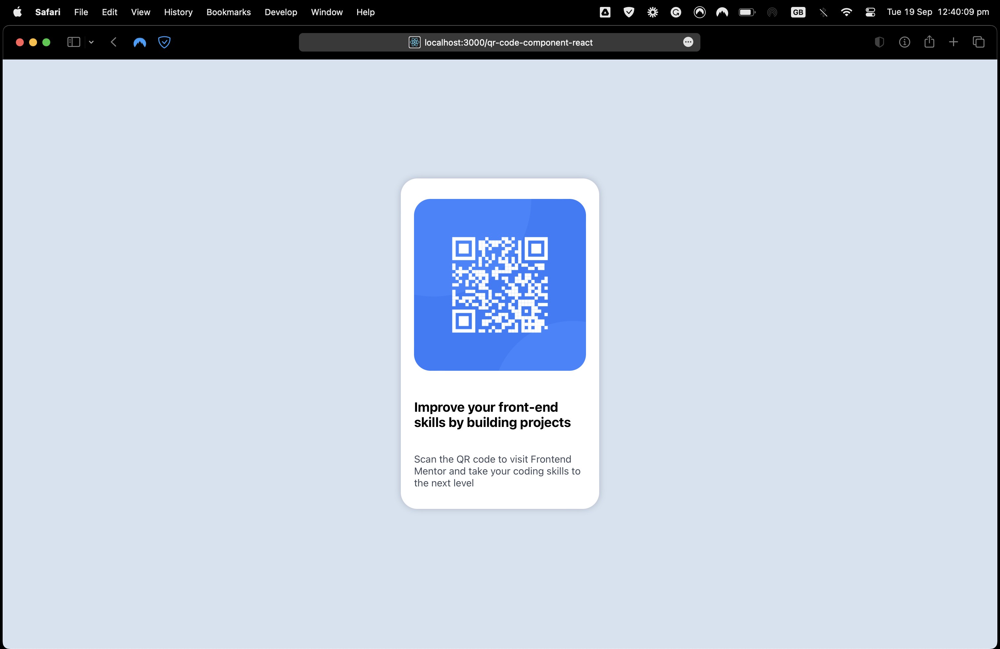
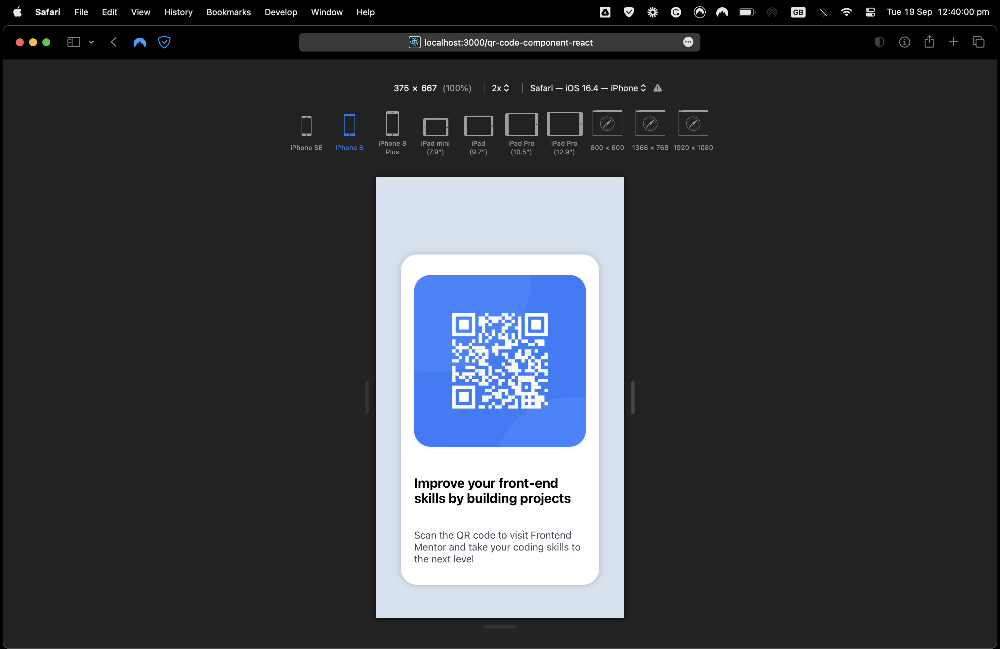

# Frontend Mentor - QR code component solution

This is a solution to the [QR code component challenge on Frontend Mentor](https://www.frontendmentor.io/challenges/qr-code-component-iux_sIO_H). Frontend Mentor challenges help you improve your coding skills by building realistic projects.

## Table of contents

- [Overview](#overview)
  - [Screenshot](#screenshot)
  - [Links](#links)
- [My process](#my-process)
  - [Built with](#built-with)
- [Author](#author)

## Overview

### Screenshot

Desktop version:

 Mobile version:

### Links

- Solution URL: [https://github.com/alicagatay/qr-code-component-react](https://github.com/alicagatay/qr-code-component-react)
- Live Site URL: [https://alicagatay.github.io/qr-code-component-react/](https://alicagatay.github.io/qr-code-component-react/)

## My process

### Built with

- CSS
- CSS Flexbox
- Mobile-first workflow
- [React.js](https://reactjs.org/) - JS library

## Author

- Website - [alicagatay.github.io](https://alicagatay.github.io/)
- Frontend Mentor - [@alicagatay](https://www.frontendmentor.io/profile/alicagatay)
- GitHub - [alicagatay](https://github.com/alicagatay)
